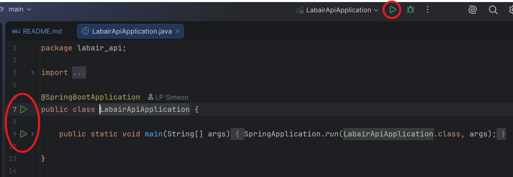

# LabAir API

This is my third and last project that was assigned to me do during the LABFORWEB course. 
It's a Backend REST API that connects to the previous project **LabAir-project-v2** (frontend); it provides all necessary APIs for the frontend to manage the users, shoe catalog, cart and orders.

Repository of LABAir-project-v2:
[Click the link](https://github.com/LPSimeon/LABAir-project-v2.git)

## Configuration

For this project I'm using **Java 17** with **Maven** and MySQL. 

What dependencies I used for the project?

1. `Spring Web`
2. `Spring Data JPA`
3. `Spring Security`
4. `Lombok`
5. `MySQL Driver` (In order to communicate with MySQL Server)
6. `JJWT (API + Impl + Jackson)` (In order to add jwt validation to logged user)

How I'm configuring the database? I added in `application.properties` the following configurations:

```properties
spring.datasource.url=jdbc:mysql://localhost:3306/labair_db?\
  useSSL=false&allowPublicKeyRetrieval=true\
  &createDatabaseIfNotExist=true
spring.datasource.username=root
spring.datasource.password=root
spring.jpa.hibernate.ddl-auto=create-drop

# to always run SQL scripts
spring.sql.init.mode=always
spring.jpa.defer-datasource-initialization=true
```

For the data I created **_data.sql_** where the Spring Boot is extracting from.

## Features

- User registration and authentication (JWT)
- Management of shoe list/catalog (CRUD + filters by category and sort)
- Cart management
- Order management and Shipping data
- CORS support for the Angular frontend (labair-project-v2) (`http://localhost:4200`)

## Project Structure
```
src/main/java/labair_api/
├── config/          # ApplicationConfig
├── controllers/     
├── dto/             
├── exceptions/      # Created some custom exceptions
├── models/          # JPA Entities
├── repositories/    # Spring Data JPA Interfaces 
├── security/        # JwtAuthentication, JwtService and SecurityConfig
└── services/        
```

### Controllers

| Controller            | Base Path                  | Description                          |
|-----------------------|----------------------------|--------------------------------------|
| `ShoeController`      | `/api/v1/scarpeList`       | Shoe List (CRUD + filter)            |
| `AuthController`      | `/api/v1/auth`             | Registration and authentication      |
| `UserController`      | `/api/v1/utente`           | User management                      |
| `CartItemController`  | `/api/v1/carrello`         | Cart Management                      |
| `OrderController`     | `/api/v1/ordine`           | Oder creation                        |

### Models (JPA entities)

- _**User**_
- _**Shoe**_ – The product that contains size, colors, its images and flags (nuovi_arrivi / best_seller)
- _**ImageColor**_ - For each color we have the set of images of the shoe
- _**CartItem**_
- _**Order**_ + _**OrderDetails**_
- _**ShippingData**_


## How to Run the project

To start the project, please click on the Run icon by opening the main class `RestApiComuniApplication`:



In order to test the endpoints, please use GUI clients like Insomnia, Postman, etc...
> [!NOTE]
> Before running the project, make sure you have MySQL Server in running


### Endpoints

By running the project, we have access to the following endpoints:

```
Index:
http://localhost:8080/

Endpoints:
http://localhost:8080/api/v1/scarpeList (GET ALL shoes)
http://localhost:8080/api/v1/scarpeList/{scarpaId} (GET, PATCH and DELETE ONE shoe)
http://localhost:8080/api/v1/auth/register (Registration with JWT)
http://localhost:8080/api/v1/auth/authenticate (Login/Authentication)
http://localhost:8080/api/v1/utente/{userId} (GET, PATCH, DELETE ONE user)
http://localhost:8080/api/v1/carrello (GET, POST)
http://localhost:8080/api/v1/carrello/{itemId} (PATCH, DELETE)
http://localhost:8080/api/v1/ordine (GET ALL orders)
http://localhost:8080/api/v1/ordine/create (POST)
http://localhost:8080/api/v1/ordine/{orderId} (DELETE)
```